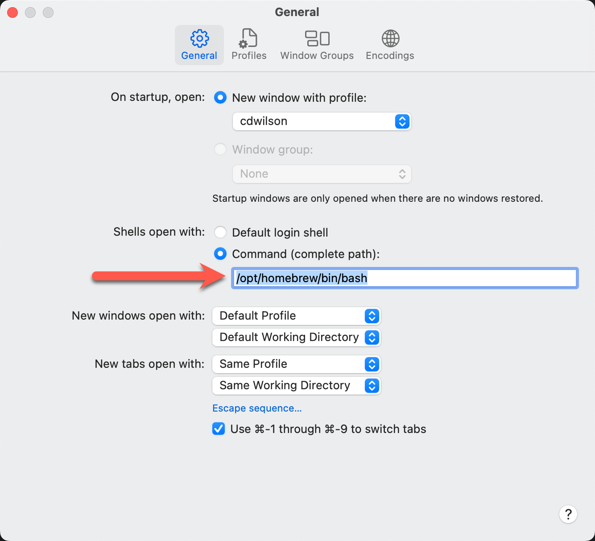
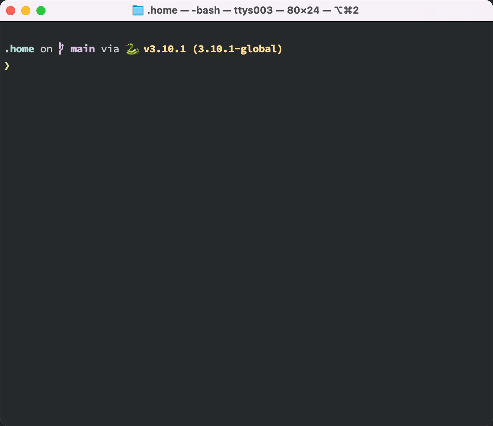
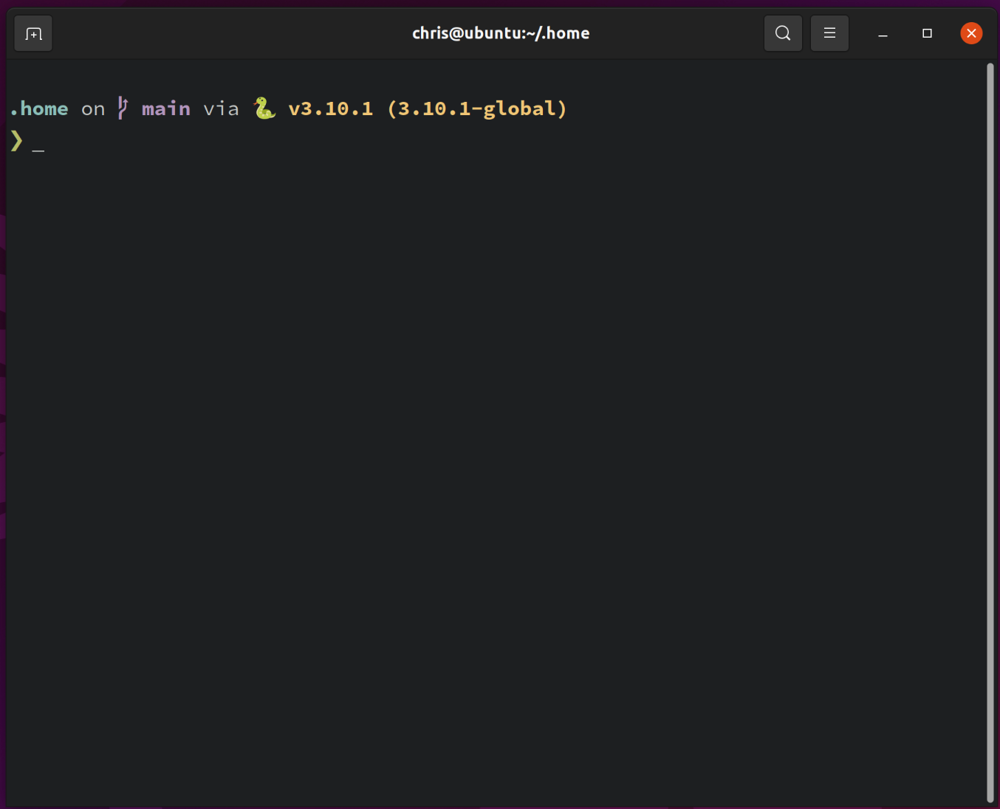
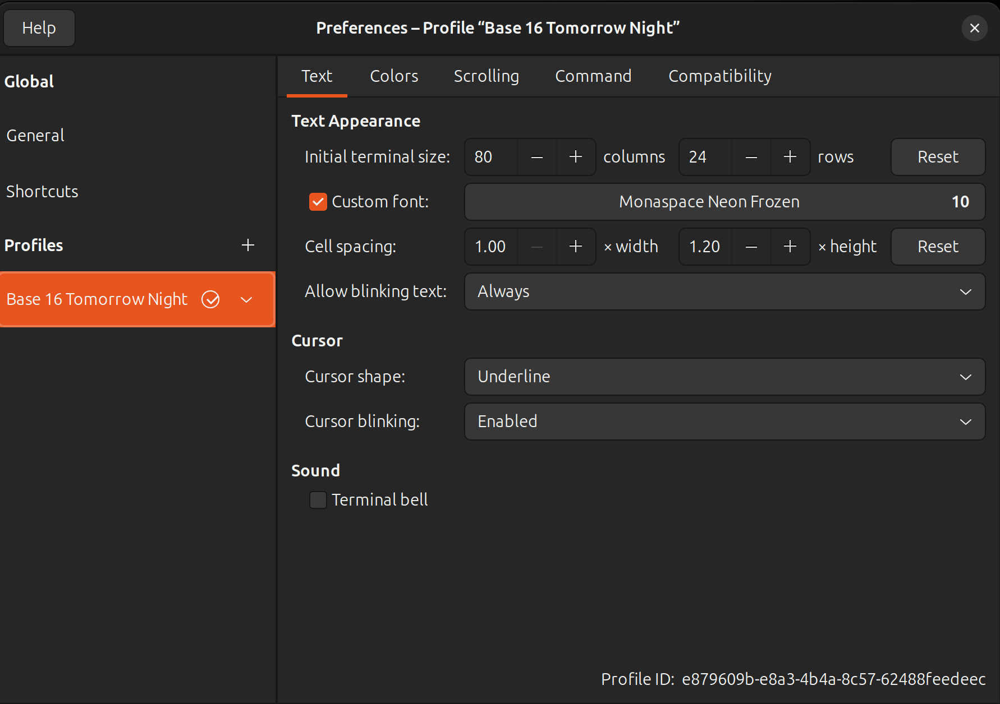
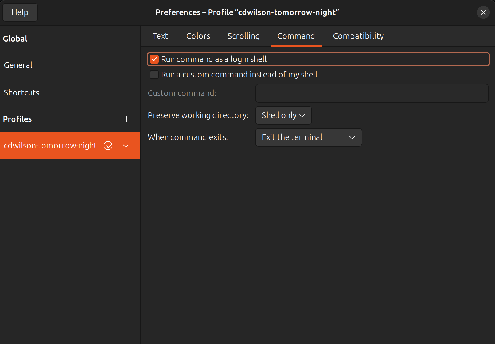

<!--
SPDX-FileCopyrightText: 2022 Chris Wilson <christopher.david.wilson@gmail.com>

SPDX-License-Identifier: CC-BY-SA-4.0
-->

# :house: dotfiles

[](https://api.reuse.software/info/github.com/cdwilson/dotfiles/)

My dotfiles in `$HOME` automatically managed by [chezmoi](https://www.chezmoi.io/).

## :computer: System Setup

### :apple: macOS Setup

#### Command Line Tools for Xcode Setup

Once you have Xcode installed, open a terminal and run the following to install the required command line developer tools:

```sh
xcode-select --install
```

#### Homebrew Setup

[Homebrew](https://brew.sh/) is a package manager for macOS that can be used to install packages that aren't included by Apple.

```sh
/bin/bash -c "$(curl -fsSL https://raw.githubusercontent.com/Homebrew/install/HEAD/install.sh)"
```

#### Git Setup

Install the latest version of Git from Homebrew:

```sh
brew install git gpg
```

#### 1Password Setup

Install 1Password password manager from Homebrew:

```sh
brew install --cask 1password
```

#### 1Password CLI Setup

With [1Password CLI](https://developer.1password.com/docs/cli), you can automate administrative tasks and load secrets straight from your command line and in your scripts.

```sh
brew install --cask 1password/tap/1password-cli
```

#### Bash Setup

The older bash 3.2 provided by Apple with macOS is not compatible with modern bash completion (e.g. homebrew's [bash-completion@2](https://formulae.brew.sh/formula/bash-completion@2) requires bash 4.2+ and [Click](https://click.palletsprojects.com/en/8.0.x/shell-completion/) requires bash 4.4+).  Instead, use a more recent bash + bash completion from home-brew.  In addition, optionally install the [bash language server](https://github.com/bash-lsp/bash-language-server/blob/master/bash-lsp) to enable editor extensions like [Bash IDE](https://marketplace.visualstudio.com/items?itemName=mads-hartmann.bash-ide-vscode) for VSCode.

```sh
brew install bash bash-completion@2

# Optional
brew install bash-language-server
```

#### Login Shell Setup

On macOS, if you're using a custom shell installed via Homebrew or MacPorts, remember to configure the shell in your terminal preferences.

1. Change the Command preference to the full path of your shell:

   

3. Add your shell to `/etc/shells`:

   ```
   # List of acceptable shells for chpass(1).
   # Ftpd will not allow users to connect who are not using
   # one of these shells.

   /bin/bash
   /bin/csh
   /bin/dash
   /bin/ksh
   /bin/sh
   /bin/tcsh
   /bin/zsh
   /opt/homebrew/bin/bash <-- Add your shell here
   ```

#### dotfiles Setup

Install the dotfiles from this repository using [chezmoi](https://www.chezmoi.io/) (**make sure to change `cdwilson` to your GitHub username!**):

```sh
sh -c "$(curl -fsLS git.io/chezmoi)" -- init --apply cdwilson
```

#### Terminal.app Setup



1. To use the prompt shown in the photo above, install https://starship.rs/:

   ```sh
   # via Homebrew for Mac
   brew install starship
   ```

2. To get started [configuring starship](https://starship.rs/config/#prompt), add your changes to `~/.config/starship.toml`

3. To use the [Hasklig](https://github.com/i-tu/Hasklig) font shown in the photo above, make sure to install the patched "Hasklug" version from [Nerd Fonts](https://www.nerdfonts.com/#home) (Starship uses many of the icons in Nerd Fonts version):

   ```sh
   # via Homebrew for Mac
   brew tap homebrew/cask-fonts
   brew install --cask font-hasklug-nerd-font
   ```

4. To use the Terminal.app profile shown in the photo above, just double click the [macOS/terminal/cdwilson.terminal](macOS/terminal/cdwilson.terminal) file in Finder.

#### `pipx` Setup

[pipx](https://pypa.github.io/pipx/) lets you easily install and run Python applications in isolated environments.

```sh
brew install pipx
```

#### `direnv` Setup

[direnv](https://direnv.net/) lets you easily load and unload environment variables depending on the current directory.

```sh
brew install direnv
```

#### `rbenv` Setup

[rbenv](https://github.com/rbenv/rbenv) is a version manager that lets you easily install and switch between multiple versions of Ruby.

1. Install dependencies for building Ruby:

   ```sh
   brew install openssl readline
   ```

2. Install `rbenv` using the [Basic GitHub Checkout](https://github.com/rbenv/rbenv#basic-github-checkout) instructions (I'm not using [rbenv-installer](https://github.com/rbenv/rbenv-installer) because I don't want rbenv installed via Homebrew on macOS):

   ```sh
   git clone https://github.com/rbenv/rbenv.git ~/.rbenv
   ```

3. Optionally, try to compile dynamic bash extension to speed up rbenv. Don't worry if it fails; rbenv will still work normally:

   ```
   cd ~/.rbenv && src/configure && make -C src
   ```

4. Install [ruby-build](https://github.com/rbenv/ruby-build) plugin that lets you easily install Ruby versions:

   ```sh
   mkdir -p "$(rbenv root)"/plugins
   git clone https://github.com/rbenv/ruby-build.git "$(rbenv root)"/plugins/ruby-build
   ```

5. Verify the state of your rbenv installation:

   ```sh
   curl -fsSL https://github.com/rbenv/rbenv-installer/raw/HEAD/bin/rbenv-doctor | bash
   ```

#### `pyenv` Setup

[pyenv](https://github.com/pyenv/pyenv) is a [rbenv](https://github.com/rbenv/rbenv)-style version manager that lets you easily install and switch between multiple versions of Python.

1. Install dependencies for building Python:

   ```sh
   brew install openssl readline sqlite3 xz zlib
   ```

2. Install `pyenv` using [pyenv-installer](https://github.com/pyenv/pyenv-installer):

   ```sh
   curl https://pyenv.run | bash
   ```

3. Optionally, try to compile a dynamic Bash extension to speed up Pyenv. Don't worry if it fails; Pyenv will still work normally:

   ```
   cd ~/.pyenv && src/configure && make -C src
   ```

4. Verify the state of your pyenv installation:

   ```sh
   pyenv doctor
   ```

------

### :penguin: Ubuntu Linux Setup

#### `apt` Setup

Update package information from the package repository and install dependencies:

```sh
sudo apt update
sudo apt upgrade
sudo apt install curl

# Optional: install a GUI desktop on a server image
sudo apt install ubuntu-desktop
sudo apt install gnome-software
```

#### `keychain` Setup

[Keychain](https://www.funtoo.org/Funtoo:Keychain) helps you to manage SSH and GPG keys in a convenient and secure manner. It acts as a frontend to ssh-agent and ssh-add, but allows you to easily have one long running ssh-agent process per system, rather than the norm of one ssh-agent per login session.

```bash
sudo apt install keychain
```

#### Git Setup

Install the latest version of Git from the package repository:

```sh
sudo apt install git gpg
```

#### 1Password Setup for amd64

```sh
curl -sS https://downloads.1password.com/linux/keys/1password.asc | sudo gpg --dearmor --output /usr/share/keyrings/1password-archive-keyring.gpg
echo "deb [arch=$(dpkg --print-architecture) signed-by=/usr/share/keyrings/1password-archive-keyring.gpg] https://downloads.1password.com/linux/debian/$(dpkg --print-architecture) stable main" | sudo tee /etc/apt/sources.list.d/1password.list
sudo mkdir -p /etc/debsig/policies/AC2D62742012EA22/
curl -sS https://downloads.1password.com/linux/debian/debsig/1password.pol | sudo tee /etc/debsig/policies/AC2D62742012EA22/1password.pol
sudo mkdir -p /usr/share/debsig/keyrings/AC2D62742012EA22
curl -sS https://downloads.1password.com/linux/keys/1password.asc | sudo gpg --dearmor --output /usr/share/debsig/keyrings/AC2D62742012EA22/debsig.gpg
sudo apt update && sudo apt install 1password
```

#### 1Password Setup for arm64

```sh
cd ~/Downloads
curl -sSO https://downloads.1password.com/linux/tar/stable/aarch64/1password-latest.tar.gz
tar -xf 1password-latest.tar.gz
sudo mkdir -p /opt/1Password
sudo mv 1password-*/* /opt/1Password
cd ~
sudo /opt/1Password/after-install.sh
touch ~/.ssh/config
# make sure to copy or link /opt/1Password/resources/1password.desktop and /opt/1Password/resources/icons/ into /usr/share/applications/ and /usr/share/icons/ respectively, and then update the icon cache by running
gtk-update-icon-cache /usr/share/icons/hicolor
```

#### 1Password CLI Setup

With [1Password CLI](https://developer.1password.com/docs/cli), you can automate administrative tasks and load secrets straight from your command line and in your scripts.

```sh
sudo apt install 1password-cli
```

#### dotfiles Setup

Install the dotfiles from this repository using [chezmoi](https://www.chezmoi.io/) (**make sure to change `cdwilson` to your GitHub username!**):

```sh
sh -c "$(curl -fsLS git.io/chezmoi)" -- init --apply cdwilson
```

#### GNOME Terminal Setup



1. To use the prompt shown in the photo above, install https://starship.rs/:

   ```sh
   sudo snap install starship
   ```

2. To get started [configuring starship](https://starship.rs/config/#prompt), add your changes to `~/.config/starship.toml`

3. To use the GNOME Terminal profile colors shown in the photo above, install https://github.com/aarowill/base16-gnome-terminal:

   ```sh
   sudo apt install gconf2
   git clone https://github.com/aaron-williamson/base16-gnome-terminal.git ~/.config/base16-gnome-terminal
   # a new profile needs to be created in the terminal preferences UI before running the next command, otherwise it will appear to do nothing (it can be deleted afterwards)
   .config/base16-gnome-terminal/color-scripts/base16-tomorrow-night.sh
   ```

4. To use the [Hasklig](https://github.com/i-tu/Hasklig) font shown in the photo above, make sure to install the patched "Hasklug" version from [Nerd Fonts](https://www.nerdfonts.com/#home) (Starship uses many of the icons in Nerd Fonts version):

   ```sh
   cd ~/Downloads
   wget https://github.com/ryanoasis/nerd-fonts/releases/download/v2.2.2/Hasklig.zip
   mkdir -p ~/.local/share/fonts
   unzip Hasklig.zip -d ~/.local/share/fonts/
   cd ~/.local/share/fonts/
   rm *Windows*
   cd ~
   fc-cache -fv
   ```

   

5. Make sure the "Run command as a login shell" is checked to ensure that `.bash_profile` is sourced:

   

#### `pipx` Setup

[pipx](https://pypa.github.io/pipx/) lets you easily install and run Python applications in isolated environments.

```sh
sudo apt install pipx
```

#### `direnv` Setup

[direnv](https://direnv.net/) lets you easily load and unload environment variables depending on the current directory.

```sh
sudo apt install direnv
```

#### `rbenv` Setup

[rbenv](https://github.com/rbenv/rbenv) is a version manager that lets you easily install and switch between multiple versions of Ruby.

1. Install dependencies for building Ruby:

   ```sh
   # Depending on your version of Ubuntu, libgdbm6 won't be available.
   # In that case, try an earlier version such as libgdbm5.
   sudo apt install autoconf bison build-essential libssl-dev libyaml-dev libreadline6-dev zlib1g-dev libncurses5-dev libffi-dev libgdbm6 libgdbm-dev libdb-dev
   ```

2. Install `rbenv` using the [Basic GitHub Checkout](https://github.com/rbenv/rbenv#basic-github-checkout) instructions (I'm not using [rbenv-installer](https://github.com/rbenv/rbenv-installer) because I don't want rbenv installed via Homebrew on macOS):

   ```sh
   git clone https://github.com/rbenv/rbenv.git ~/.rbenv
   ```

3. Optionally, try to compile dynamic bash extension to speed up rbenv. Don't worry if it fails; rbenv will still work normally:

   ```
   cd ~/.rbenv && src/configure && make -C src
   ```

4. Install [ruby-build](https://github.com/rbenv/ruby-build) plugin that lets you easily install Ruby versions:

   ```sh
   mkdir -p "$(rbenv root)"/plugins
   git clone https://github.com/rbenv/ruby-build.git "$(rbenv root)"/plugins/ruby-build
   ```

5. Verify the state of your rbenv installation:

   ```sh
   curl -fsSL https://github.com/rbenv/rbenv-installer/raw/HEAD/bin/rbenv-doctor | bash
   ```

#### `pyenv` Setup

[pyenv](https://github.com/pyenv/pyenv) is a [rbenv](https://github.com/rbenv/rbenv)-style version manager that lets you easily install and switch between multiple versions of Python.

1. Install dependencies for building Python:

   ```sh
   sudo apt install make build-essential libssl-dev zlib1g-dev \
   libbz2-dev libreadline-dev libsqlite3-dev wget curl llvm \
   libncursesw5-dev xz-utils tk-dev libxml2-dev libxmlsec1-dev libffi-dev liblzma-dev
   ```

2. Install `pyenv` using [pyenv-installer](https://github.com/pyenv/pyenv-installer):

   ```sh
   curl https://pyenv.run | bash
   ```

3. Optionally, try to compile a dynamic Bash extension to speed up Pyenv. Don't worry if it fails; Pyenv will still work normally:

   ```sh
   cd ~/.pyenv && src/configure && make -C src
   ```

4. Verify the state of your pyenv installation:

   ```sh
   pyenv doctor
   ```

------

### GitHub Commit Verification Setup

This allows git commits made via the GitHub web UI to be verified locally (e.g. `git verify-commit <commit>`:

```sh
curl https://github.com/web-flow.gpg | gpg --import
gpg --edit-key noreply@github.com trust quit # choose option 5 = I trust ultimately
```

------

### :snake: Install python-based tools via `pipx`

#### `pre-commit` Setup

[pre-commit](https://pre-commit.com/) is a framework for managing git pre-commit hooks.

```sh
pipx install pre-commit

# automatically enabling pre-commit on repositories
# https://pre-commit.com/#automatically-enabling-pre-commit-on-repositories
pre-commit init-templatedir ~/.git-template
```

#### `poetry` Setup

[poetry](https://python-poetry.org/) is a tool for dependency management and packaging in Python.

```sh
pipx install poetry
```

#### `pdm` Setup

[PDM](https://pdm.fming.dev/) is a modern Python package manager with [PEP 582](https://www.python.org/dev/peps/pep-0582/) support. It installs and manages packages in a similar way to `npm` that doesn't need to create a virtualenv at all!

```sh
pipx install pdm
```

------

## License Information

This repository is compliant with version 3.0 of the [REUSE Specification](https://reuse.software/spec/).

License files are contained in the [LICENSES/](LICENSES/) directory and additional license & copyright information can be found in [.reuse/dep5](.reuse/dep5).

Run the following for detailed copyright & license information on individual files:

```sh
pip install reuse
reuse spdx
```
