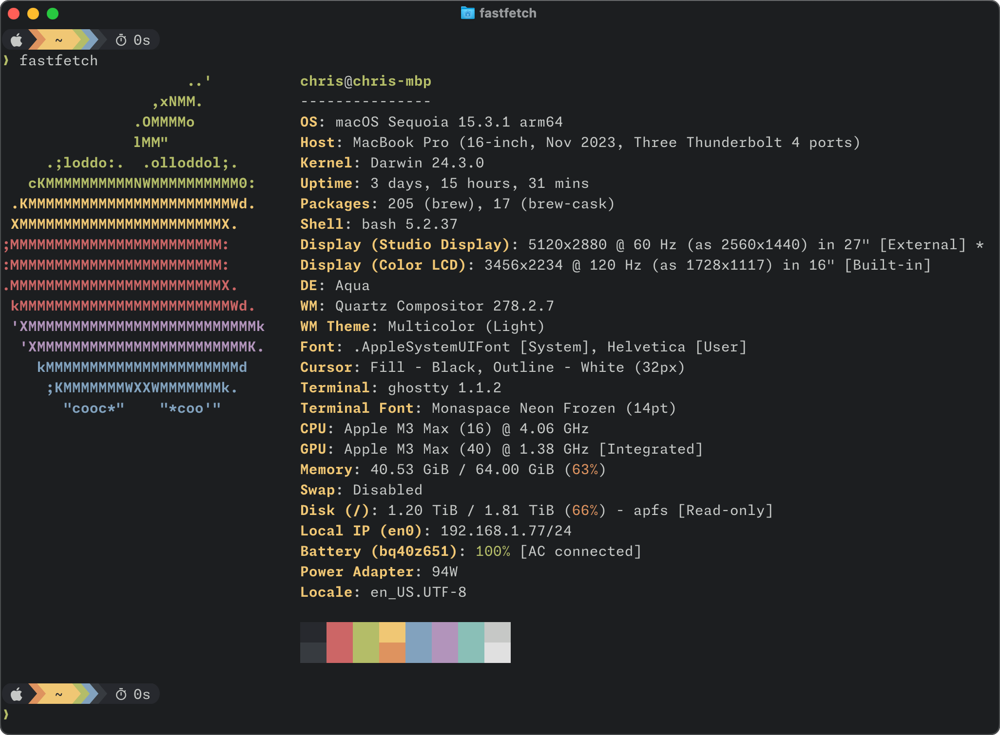
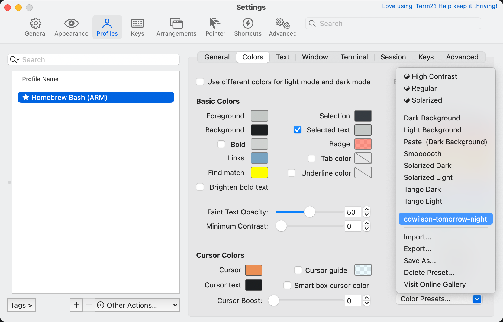
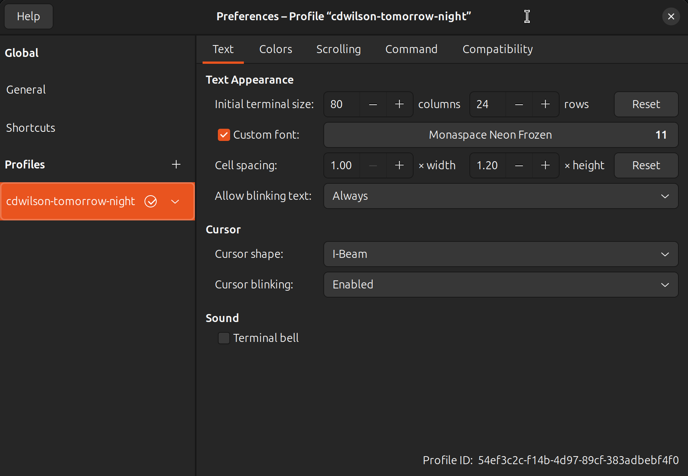
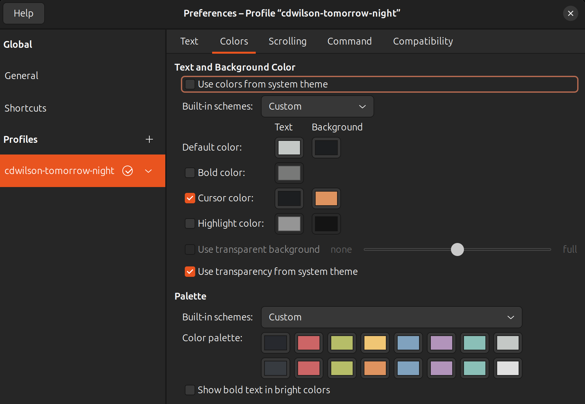

# :house: dotfiles

[](https://api.reuse.software/info/github.com/cdwilson/dotfiles/)

My dotfiles in `$HOME` automatically managed by [chezmoi](https://www.chezmoi.io/).

## :computer: System Setup

### :apple: macOS Setup



#### Command Line Tools for Xcode Setup

Once you have Xcode installed, open a terminal and run the following to install the required command line developer tools:

```sh
xcode-select --install
```

#### Homebrew Setup

[Homebrew](https://brew.sh/) is a package manager for macOS that can be used to install packages that aren't included by Apple.

```sh
/bin/bash -c "$(curl -fsSL https://raw.githubusercontent.com/Homebrew/install/HEAD/install.sh)"
```

#### Git Setup

Install the latest version of Git from Homebrew:

```sh
brew install git gpg
```

#### 1Password Setup

Install 1Password password manager from Homebrew:

```sh
brew install --cask 1password
```

After installing, go to "Settings…" → "Developer" → "Set Up SSH Agent…" and make sure the SSH agent and CLI are enabled:


#### 1Password CLI Setup

With [1Password CLI](https://developer.1password.com/docs/cli), you can automate administrative tasks and load secrets straight from your command line and in your scripts.

```sh
brew install --cask 1password/tap/1password-cli
```

#### Bash Setup

The older bash 3.2 provided by Apple with macOS is not compatible with modern bash completion (e.g. homebrew's [bash-completion@2](https://formulae.brew.sh/formula/bash-completion@2) requires bash 4.2+ and [Click](https://click.palletsprojects.com/en/8.0.x/shell-completion/) requires bash 4.4+).  Instead, use a more recent bash + bash completion from home-brew.

```sh
brew install bash bash-completion@2
```

In addition, optionally install the [bash language server](https://github.com/bash-lsp/bash-language-server/blob/master/bash-lsp) to enable editor extensions like [Bash IDE](https://marketplace.visualstudio.com/items?itemName=mads-hartmann.bash-ide-vscode) for VSCode.

```sh
# Optional
brew install bash-language-server
```

#### Terminal.app Setup

On macOS, if you're using a custom shell installed via Homebrew or MacPorts, remember to configure the shell in your terminal preferences.

1. Change the Command preference to the full path of your shell:

   

3. Add your shell to `/etc/shells`:

   ```
   # List of acceptable shells for chpass(1).
   # Ftpd will not allow users to connect who are not using
   # one of these shells.

   /bin/bash
   /bin/csh
   /bin/dash
   /bin/ksh
   /bin/sh
   /bin/tcsh
   /bin/zsh
   /opt/homebrew/bin/bash <-- Add your shell here
   ```

3. To use the Terminal.app profile, just double click the [`macOS/terminal/cdwilson.terminal`](macOS/terminal/cdwilson.terminal) file in Finder.

#### dotfiles Setup

Install the dotfiles from this repository using [chezmoi](https://www.chezmoi.io/) (**make sure to change `cdwilson` to your GitHub username!**):

```sh
sh -c "$(curl -fsLS git.io/chezmoi)" -- init --apply cdwilson
```

#### Starship Setup

[Starship](https://starship.rs) is the minimal, blazing-fast, and infinitely customizable prompt for any shell!

1. Install starship:

   ```sh
   # via Homebrew for Mac
   brew install starship
   ```

2. To get started [configuring starship](https://starship.rs/config/#prompt), add your changes to `~/.config/starship.toml`

#### Font Setup

To install the [Monaspace](https://monaspace.githubnext.com/) font:

```sh
brew install --cask font-monaspace
brew install --cask font-symbols-only-nerd-font
```

> [!NOTE]
> Although Monaspace added nerd fonts in the `v1.200` release, it does not contain some of the symbols that the `font-symbols-only-nerd-font` font does. In addition, the nerd fonts bundled with with Monaspace are scaled so they fit within the monospaced "box", resulting in smaller icons.
>
> To avoid these issues, the `Monaspace Neon Frozen` is used (which does not contain any Nerd Fonts) and `Symbols Nerd Font` is configured as a fallback font which provides the Nerd Font icons.

#### Ghostty Setup

[Ghostty](https://ghostty.org/) is a fast, feature-rich, and cross-platform terminal emulator that uses platform-native UI and GPU acceleration.

```sh
brew install --cask ghostty
```

#### iTerm2 Setup

[iTerm2](https://iterm2.com/) is a replacement for Terminal and the successor to iTerm.

1. Install iTerm2 via Homebrew:

   ```sh
   brew install --cask iterm2
   ```

2. Install Homebrew Bash (ARM) profile from [`macOS/iTerm2/profiles/Homebrew Bash (ARM).json`](macOS/iTerm2/profiles/Homebrew%20Bash%20(ARM).json):

   

3. Install the `base16-tomorrow-night` color profile from [`macOS/iTerm2/color_presets/base16-tomorrow-night.itermcolors`](macOS/iTerm2/color_presets/base16-tomorrow-night.itermcolors):

   

#### `uv` Setup

[uv](https://github.com/astral-sh/uv) is an extremely fast Python package and project manager, written in Rust.

```sh
curl -LsSf https://astral.sh/uv/install.sh | sh
```

#### `direnv` Setup

[direnv](https://direnv.net/) lets you easily load and unload environment variables depending on the current directory.

```sh
brew install direnv
```

#### `rbenv` Setup

[rbenv](https://github.com/rbenv/rbenv) is a version manager that lets you easily install and switch between multiple versions of Ruby.

1. Install dependencies for building Ruby:

   ```sh
   brew install openssl readline
   ```

2. Install `rbenv` using the [Basic GitHub Checkout](https://github.com/rbenv/rbenv#basic-github-checkout) instructions (I'm not using [rbenv-installer](https://github.com/rbenv/rbenv-installer) because I don't want rbenv installed via Homebrew on macOS):

   ```sh
   git clone https://github.com/rbenv/rbenv.git ~/.rbenv
   ```

3. Optionally, try to compile dynamic bash extension to speed up rbenv. Don't worry if it fails; rbenv will still work normally:

   ```sh
   cd ~/.rbenv && src/configure && make -C src
   ```

4. Install [ruby-build](https://github.com/rbenv/ruby-build) plugin that lets you easily install Ruby versions:

   ```sh
   mkdir -p "$(rbenv root)"/plugins
   git clone https://github.com/rbenv/ruby-build.git "$(rbenv root)"/plugins/ruby-build
   ```

5. Verify the state of your rbenv installation:

   ```sh
   curl -fsSL https://github.com/rbenv/rbenv-installer/raw/HEAD/bin/rbenv-doctor | bash
   ```

#### `eza` Setup

[eza](https://eza.rocks) is a modern, maintained replacement for ls.

```sh
brew install eza
```

#### `ripgrep` Setup

[ripgrep](https://github.com/BurntSushi/ripgrep) is a line-oriented search tool that recursively searches the current directory for a regex pattern.

```sh
brew install ripgrep
```

#### `bat` Setup

[bat](https://github.com/sharkdp/bat) is a *cat(1)* clone with syntax highlighting and Git integration.

```sh
brew install bat
```

#### `fzf` Setup

[fzf](https://junegunn.github.io/fzf/) is a general-purpose command-line fuzzy finder.

```sh
brew install fzf
```

#### `fastfetch` Setup

[fastfetch](https://github.com/fastfetch-cli/fastfetch) is a maintained, feature-rich and performance oriented, neofetch like system information tool.

```sh
brew install fastfetch
```

------

### :penguin: Ubuntu Linux Setup


#### `apt` Setup

Update package information from the package repository and install dependencies:

```sh
sudo apt update
sudo apt upgrade
sudo apt install curl
sudo locale-gen en_US.UTF-8

# Optional: install a GUI desktop on a server image
sudo apt install ubuntu-desktop
sudo apt install gnome-software
```

<!--
#### `keychain` Setup

[Keychain](https://www.funtoo.org/Funtoo:Keychain) helps you to manage SSH and GPG keys in a convenient and secure manner. It acts as a frontend to ssh-agent and ssh-add, but allows you to easily have one long running ssh-agent process per system, rather than the norm of one ssh-agent per login session.

```bash
sudo apt install keychain
```
-->

#### Git Setup

Install the latest version of Git from the package repository:

```sh
sudo apt install git gpg
```

#### 1Password Setup

##### 1Password Setup for amd64

```sh
curl -sS https://downloads.1password.com/linux/keys/1password.asc | sudo gpg --dearmor --output /usr/share/keyrings/1password-archive-keyring.gpg
echo "deb [arch=$(dpkg --print-architecture) signed-by=/usr/share/keyrings/1password-archive-keyring.gpg] https://downloads.1password.com/linux/debian/$(dpkg --print-architecture) stable main" | sudo tee /etc/apt/sources.list.d/1password.list
sudo mkdir -p /etc/debsig/policies/AC2D62742012EA22/
curl -sS https://downloads.1password.com/linux/debian/debsig/1password.pol | sudo tee /etc/debsig/policies/AC2D62742012EA22/1password.pol
sudo mkdir -p /usr/share/debsig/keyrings/AC2D62742012EA22
curl -sS https://downloads.1password.com/linux/keys/1password.asc | sudo gpg --dearmor --output /usr/share/debsig/keyrings/AC2D62742012EA22/debsig.gpg
sudo apt update && sudo apt install 1password
```

##### 1Password Setup for arm64

```sh
cd ~/Downloads
curl -sSO https://downloads.1password.com/linux/tar/stable/aarch64/1password-latest.tar.gz
tar -xf 1password-latest.tar.gz
sudo mkdir -p /opt/1Password
sudo mv 1password-*/* /opt/1Password
sudo /opt/1Password/after-install.sh
cd ~
mkdir ~/.ssh
chmod 700 ~/.ssh
touch ~/.ssh/config
cd /usr/share/applications/
sudo ln -s /opt/1Password/resources/1password.desktop 1password.desktop
cd /usr/share/icons/hicolor/256x256/apps/
sudo ln -s /opt/1Password/resources/icons/hicolor/256x256/apps/1password.png 1password.png
cd /usr/share/icons/hicolor/32x32/apps/
sudo ln -s /opt/1Password/resources/icons/hicolor/32x32/apps/1password.png 1password.png
cd /usr/share/icons/hicolor/512x512/apps/
sudo ln -s /opt/1Password/resources/icons/hicolor/512x512/apps/1password.png 1password.png
cd /usr/share/icons/hicolor/64x64/apps/
sudo ln -s /opt/1Password/resources/icons/hicolor/64x64/apps/1password.png 1password.png
sudo gtk-update-icon-cache /usr/share/icons/hicolor
```

After installing, go to "Settings…" → "Developer" → "Set Up SSH Agent…" and make sure the SSH agent and CLI are enabled:


#### 1Password CLI Setup

With [1Password CLI](https://developer.1password.com/docs/cli), you can automate administrative tasks and load secrets straight from your command line and in your scripts.

```sh
curl -sS https://downloads.1password.com/linux/keys/1password.asc | sudo gpg --dearmor --output /usr/share/keyrings/1password-archive-keyring.gpg

echo "deb [arch=$(dpkg --print-architecture) signed-by=/usr/share/keyrings/1password-archive-keyring.gpg] https://downloads.1password.com/linux/debian/$(dpkg --print-architecture) stable main" | sudo tee /etc/apt/sources.list.d/1password.list

sudo mkdir -p /etc/debsig/policies/AC2D62742012EA22/
curl -sS https://downloads.1password.com/linux/debian/debsig/1password.pol | sudo tee /etc/debsig/policies/AC2D62742012EA22/1password.pol
sudo mkdir -p /usr/share/debsig/keyrings/AC2D62742012EA22
curl -sS https://downloads.1password.com/linux/keys/1password.asc | sudo gpg --dearmor --output /usr/share/debsig/keyrings/AC2D62742012EA22/debsig.gpg

sudo apt update && sudo apt install 1password-cli

op --version
```

#### dotfiles Setup

Install the dotfiles from this repository using [chezmoi](https://www.chezmoi.io/) (**make sure to change `cdwilson` to your GitHub username!**):

```sh
sh -c "$(curl -fsLS git.io/chezmoi)" -- init --apply cdwilson
```

#### Starship Setup

[Starship](https://starship.rs) is the minimal, blazing-fast, and infinitely customizable prompt for any shell!

1. Install starship:

   ```sh
   curl -sS https://starship.rs/install.sh | sh
   ```

2. To get started [configuring starship](https://starship.rs/config/#prompt), add your changes to `~/.config/starship.toml`

#### Font Setup

To install the [Monaspace](https://monaspace.githubnext.com/) font:

```sh
cd ~/Downloads
wget https://github.com/githubnext/monaspace/releases/download/v1.200/monaspace-v1.200.zip
mkdir -p ~/.local/share/fonts
unzip monaspace-v1.200.zip
cd monaspace-v1.200/
bash util/install_linux.sh
cd -
rm -rf monaspace-v1.200/
fc-cache -fv
```

To install the `Symbols Nerd Font` font from [Nerd Fonts](https://www.nerdfonts.com/#home):

```sh
cd ~/Downloads
wget https://github.com/ryanoasis/nerd-fonts/releases/download/v3.3.0/NerdFontsSymbolsOnly.zip
mkdir -p ~/.local/share/fonts
unzip NerdFontsSymbolsOnly.zip -d ~/.local/share/fonts/
fc-cache -fv
```

> [!NOTE]
> Although Monaspace added nerd fonts in the `v1.200` release, it does not contain some of the symbols that the `font-symbols-only-nerd-font` font does. In addition, the nerd fonts bundled with with Monaspace are scaled so they fit within the monospaced "box", resulting in smaller icons.
>
> To avoid these issues, the `Monaspace Neon Frozen` is used (which does not contain any Nerd Fonts) and `Symbols Nerd Font` is configured as a fallback font which provides the Nerd Font icons.

#### GNOME Terminal Setup

1. To use the [Monaspace](https://github.com/i-tu/Hasklig) font:

   

2. To use the [Base16](https://github.com/chriskempson/base16) color scheme, install <https://github.com/aarowill/base16-gnome-terminal>:

   ```sh
   sudo apt install gconf2 uuid-runtime
   git clone https://github.com/aaron-williamson/base16-gnome-terminal.git ~/.config/base16-gnome-terminal
   # a new profile needs to be created in the terminal preferences UI before running the next command, otherwise it will appear to do nothing (it can be deleted afterwards)
   ~/.config/base16-gnome-terminal/color-scripts/base16-tomorrow-night.sh
   ```

   

3. Make sure the "Run command as a login shell" is checked to ensure that `.bash_profile` is sourced:

   

#### Ghostty Setup

[Ghostty](https://ghostty.org/) is a fast, feature-rich, and cross-platform terminal emulator that uses platform-native UI and GPU acceleration.

```sh
sudo apt install libonig5
/bin/bash -c "$(curl -fsSL https://raw.githubusercontent.com/mkasberg/ghostty-ubuntu/HEAD/install.sh)"
```

#### `uv` Setup

[uv](https://github.com/astral-sh/uv) is an extremely fast Python package and project manager, written in Rust.

```sh
curl -LsSf https://astral.sh/uv/install.sh | sh
```

#### `direnv` Setup

[direnv](https://direnv.net/) lets you easily load and unload environment variables depending on the current directory.

```sh
sudo apt install direnv
```

#### `rbenv` Setup

[rbenv](https://github.com/rbenv/rbenv) is a version manager that lets you easily install and switch between multiple versions of Ruby.

1. Install dependencies for building Ruby:

   ```sh
   # Depending on your version of Ubuntu, libgdbm6 won't be available.
   # In that case, try an earlier version such as libgdbm5.
   sudo apt install autoconf bison build-essential libssl-dev libyaml-dev libreadline6-dev zlib1g-dev libncurses5-dev libffi-dev libgdbm6 libgdbm-dev libdb-dev
   ```

2. Install `rbenv` using the [Basic GitHub Checkout](https://github.com/rbenv/rbenv#basic-github-checkout) instructions (I'm not using [rbenv-installer](https://github.com/rbenv/rbenv-installer) because I don't want rbenv installed via Homebrew on macOS):

   ```sh
   git clone https://github.com/rbenv/rbenv.git ~/.rbenv
   ```

3. Optionally, try to compile dynamic bash extension to speed up rbenv. Don't worry if it fails; rbenv will still work normally:

   ```sh
   cd ~/.rbenv && src/configure && make -C src
   ```

4. Restart the shell to make sure `rbenv` is available

   ```sh
   rbenv --version
   ```

5. Install [ruby-build](https://github.com/rbenv/ruby-build) plugin that lets you easily install Ruby versions:

   ```sh
   mkdir -p "$(rbenv root)"/plugins
   git clone https://github.com/rbenv/ruby-build.git "$(rbenv root)"/plugins/ruby-build
   ```

6. Verify the state of your rbenv installation:

   ```sh
   curl -fsSL https://github.com/rbenv/rbenv-installer/raw/HEAD/bin/rbenv-doctor | bash
   ```

#### `eza` Setup

[eza](https://eza.rocks) is a modern, maintained replacement for ls.

First make sure you have the `gpg` command, and otherwise install it via:

```sh
sudo apt update
sudo apt install -y gpg
```

Then install `eza` via:

```sh
sudo mkdir -p /etc/apt/keyrings
wget -qO- https://raw.githubusercontent.com/eza-community/eza/main/deb.asc | sudo gpg --dearmor -o /etc/apt/keyrings/gierens.gpg
echo "deb [signed-by=/etc/apt/keyrings/gierens.gpg] http://deb.gierens.de stable main" | sudo tee /etc/apt/sources.list.d/gierens.list
sudo chmod 644 /etc/apt/keyrings/gierens.gpg /etc/apt/sources.list.d/gierens.list
sudo apt update
sudo apt install -y eza
```

#### `ripgrep` Setup

[ripgrep](https://github.com/BurntSushi/ripgrep) is a line-oriented search tool that recursively searches the current directory for a regex pattern.

```sh
sudo apt install ripgrep
```

#### `bat` Setup

[bat](https://github.com/sharkdp/bat) is a *cat(1)* clone with syntax highlighting and Git integration.

```sh
sudo apt install bat
```

> [!IMPORTANT]
>
> Note that the executable may be installed as `batcat` instead of `bat` (due to [a name clash with another package](https://github.com/sharkdp/bat/issues/982)). You can set up a `bat` -> `batcat` symlink or alias to prevent any issues that may come up because of this and to be consistent with other distributions:
>
> ```sh
> mkdir -p ~/.local/bin
> ln -s /usr/bin/batcat ~/.local/bin/bat
> ```

#### `fzf` Setup

[fzf](https://junegunn.github.io/fzf/) is a general-purpose command-line fuzzy finder.

```sh
# Installing via apt currently installs fzf < 0.48.0 which is needed for the --bash option
# sudo apt install fzf

# Instead, install the latest version from GitHub via go install
# TODO: switch back to the apt method once the Ubuntu fzf package is updated >= 0.48.0
sudo apt install golang-go
go install github.com/junegunn/fzf@latest
```

#### `fastfetch` Setup

[fastfetch](https://github.com/fastfetch-cli/fastfetch) is a maintained, feature-rich and performance oriented, neofetch like system information tool.

```sh
sudo add-apt-repository ppa:zhangsongcui3371/fastfetch
sudo apt update
sudo apt install fastfetch
```

------

### 🔐 GitHub Commit Verification Setup

This allows git commits made via the GitHub web UI to be verified locally (e.g. `git verify-commit <commit>`:

```sh
curl https://github.com/web-flow.gpg | gpg --import
gpg --edit-key noreply@github.com trust quit # choose option 5 = I trust ultimately
```

------

### :snake: Install python-based tools via `uv`

#### `pre-commit` Setup

[pre-commit](https://pre-commit.com/) is a framework for managing git pre-commit hooks.

```sh
uv tool install pre-commit

# automatically enabling pre-commit on repositories
# https://pre-commit.com/#automatically-enabling-pre-commit-on-repositories
pre-commit init-templatedir ~/.git-template
```

------

## License Information

This repository is compliant with version 3.2 of the [REUSE Specification](https://reuse.software/spec/).

License files are contained in the [LICENSES/](LICENSES/) directory and additional copyright & license information can be found in [REUSE.toml](REUSE.toml).

Install the [reuse tool](https://github.com/fsfe/reuse-tool) and run the following commands for detailed copyright & license information on individual files:

```sh
reuse spdx
```
